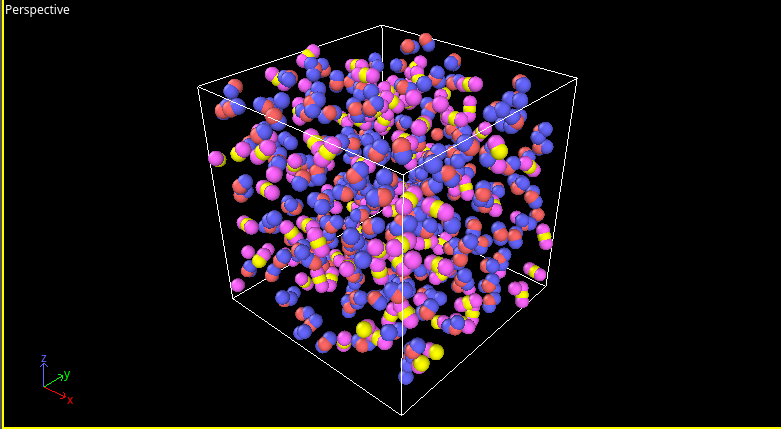

<!--
# test

## test1

👍

```python
import pandas as pd 
df = pd.DataFrame({'a':[1,2,3],'b':[4,5,6]})  
print(df)
```

$$
\int_a^b x^2 = \frac{1}{3}x^3|_a^b
$$

## test3

- good test

1. point


| col1 | col2 | col3 | col4 | col5   |
| ------ | ------ | ------ | ------ | -------- |
| good | how  | are  | you  | doing? |
| 1    | 2    | 3    | 4    | 5      |

> this is a very good tool to implement everything

👀️

yes `good`

[Google](https://www.google.com/)

---




---

<div align=center>

 
</div>

---

<div align=center>

 

</div>
-->


# Variational Principle 

## Hellinger-Reissner Two Fields Model
### 1. Variation

$$
\Pi_{HR}(\mathbf{J}, \phi; \mathcal{D}) = 
\int_{\Omega} \left( 
\frac{1}{2} \mathbf{J}^\mathrm{T} \mathbf{D}^{-1} \mathbf{J} 
+ \mathbf{J} \cdot \nabla \phi 
+ Q \phi 
\right) d\Omega 
- \int_{\Gamma_D} \lambda_\phi (\phi - \bar{\phi}) \, d\Gamma 
- \int_{\Gamma_N} \bar{J}_n \phi \, d\Gamma 
\tag{1}
$$

Ignore the boundary conditions, by performing the variation with respect to $\mathbf{J}$ we get:
$$
\mathbf{J} = -\boldsymbol{\mathcal{D}}\nabla\phi 
\tag{2}
$$
> Divergence theorem
$$
\int_{\Omega} \mathbf{f} \cdot \nabla \phi \, d\Omega 
= \int_{\partial \Omega} (\mathbf{f} \cdot \mathbf{n}) \, \phi \, d\Gamma 
- \int_{\Omega} (\nabla \cdot \mathbf{f}) \, \phi \, d\Omega 
\tag{3}
$$
$$
\Pi_{HR}(\mathbf{J}, \phi; \mathcal{D}) = 
\int_{\Omega} \left( 
\frac{1}{2} \mathbf{J}^\mathrm{T} \mathbf{D}^{-1} \mathbf{J} 
- \phi (\nabla \cdot \mathbf{J}) 
+ Q \phi 
\right) d\Omega 
+ \int_{\partial \Omega} (\mathbf{J} \cdot \mathbf{n}) \, \phi \, d\Gamma 
- \int_{\Gamma_D} \lambda_\phi (\phi - \bar{\phi}) \, d\Gamma 
- \int_{\Gamma_N} \bar{J}_n \, \phi \, d\Gamma
\tag{4}
$$
where $\Gamma_D \cup \Gamma_N \subseteq \partial \Omega$

Ignore the boundary conditions, by performing the variation with respect to $\phi$ we get:
$$
\nabla \cdot \mathbf{J} - Q = 0 
\tag{5}
$$

Then we get the variational term of the loss function:
$$
\mathcal{L}_{HR}(\mathbf{J}, \phi; \mathcal{D}) = 
\int_{\Omega} \left[ 
\left( \mathbf{J} + \mathcal{D} \nabla \phi \right)^2 
+ \left( \nabla \cdot \mathbf{J} - Q \right)^2 
\right] d\Omega
\tag{6}
$$

### 2. Boundary Conditions
- Dirichlet boundary condition
$$
\delta_{\lambda_\phi} \left( \int_{\Gamma_D} \lambda_\phi (\phi - \bar{\phi}) \, d\Gamma \right) = 0 
\tag{7}
$$
$$
\Rightarrow (\phi - \bar{\phi}) = 0 
$$
$$
\Rightarrow \phi = \bar{\phi} \quad \text{on } \Gamma_D
$$

$$
\delta_{\phi} \left( \int_{\Gamma_D} (\mathbf{J} \cdot \mathbf{n}) \, \phi 
- \lambda_\phi (\phi - \bar{\phi}) \, d\Gamma \right) = 0 
\tag{8}
$$
$$
\Rightarrow \lambda_\phi = \mathbf{J} \cdot \mathbf{n}
$$

- Neumann boundary condition
$$
\delta_{\phi} \left( \int_{\Gamma_N} (\mathbf{J} \cdot \mathbf{n} - \bar{J}_n) \, \phi \, d\Omega \right) = 0 
\tag{9}
$$
$$
\Rightarrow \bar{J}_n = \mathbf{J} \cdot \mathbf{n} \quad \text{on } \Gamma_N
$$

- Material interface boundary condition
    - Essential condition - Continuity of concentration
    $$
    \phi_1 = \phi_2
    $$
    - Natural condition - Continuity of flux
    $$
    \mathbf{J}_1 \cdot \mathbf{n} = -\mathbf{J}_2 \cdot \mathbf{n}
    $$
    Ignore the boundary conditions, by performing the variation with respect to $\phi$ we get:
    $$
    \int_{\Omega} (\nabla \cdot \mathbf{J} - \mathbf{Q}) \, \delta \phi \, d\Omega 
    = \int_{\partial \Omega} (\mathbf{J} \cdot \mathbf{n}) \, \delta \phi \, d\Omega 
    - \int_{\Omega} \mathbf{J} \cdot \nabla(\delta \phi) \, d\Omega 
    - \int_{\Omega} \mathbf{Q} \, \delta \phi \, d\Omega 
    \tag{10}
    $$
    $$
    \Rightarrow \int_{\Gamma_I} (\mathbf{J}_1 \cdot \mathbf{n}_1 + \mathbf{J}_2 \cdot \mathbf{n}_2) \, \delta \phi \, d\Omega = 0
    $$
