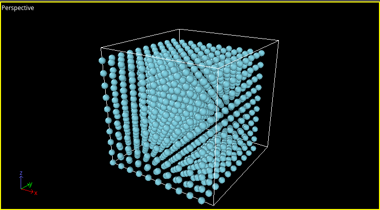

# test

## test1

👍

```python
import pandas as pd 
df = pd.DataFrame({'a':[1,2,3],'b':[4,5,6]})  
print(df)
```

$$
\int_a^b x^2 = \frac{1}{3}x^3|_a^b
$$

## test3

- good

1. point


| col1 | col2 | col3 | col4 | col5   |
| ------ | ------ | ------ | ------ | -------- |
| good | how  | are  | you  | doing? |
| 1    | 2    | 3    | 4    | 5      |

> this is a very good tool to implement everything

👀️

yes `good`

[Google](https://www.google.com/)

---


